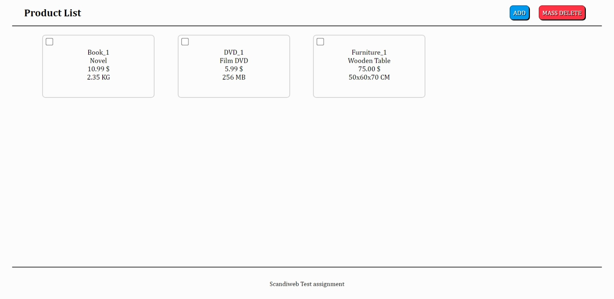
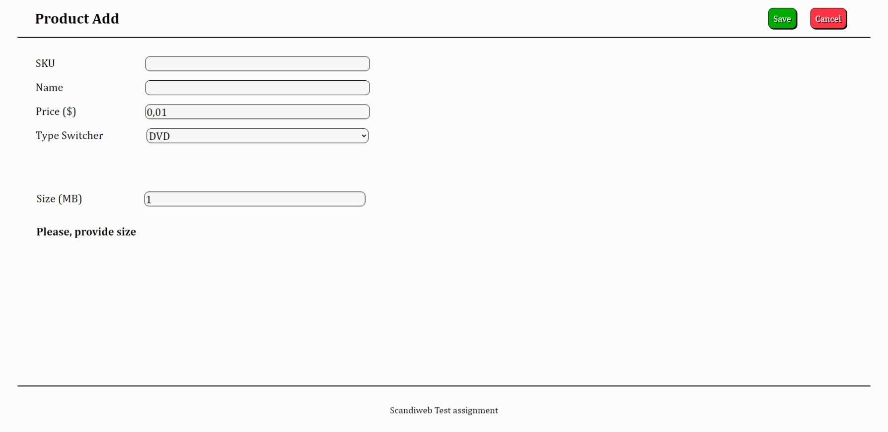

# ScandiWeb's Assignment (Junior Web Developer position)

## IMPORTANT NOTE!
Repository is archived due to completely finished assignment and interview phase.
##

This repository contains the source code for the assignment for Junior Web Developer position at ScandiWeb.

List of requirements and criteria can be found [HERE][Requirements].

Preview:

 

## Feedback/Learning points _(in chronological order)_

### 29th of June
* Please create a seperate class for db connection logic. This would be cleaner and more readable oop approach.
* For OOP you would need to demonstrate code structuring in meaningful classes that extend each other, so we would like to see an abstract class for the main product logic. An approach for this would be to have a product base class, that would hold all logic common to all products and then specific product type would extend the product base class with that type-specific stuff.
* Please avoid having html code as string inside php classes _(display-products.php)_. For displaying products don’t need to have a seperate class. You can use either main product class or a typed based child class.
* If user tries to save product with one and the same sku he/she is redirected to product list page without any error _(it gives impression that product got saved successfully)_. In such case please prevent form submission and show the error message to the user.

### 19th of July
* Adjust your file structure and separate classes, do not declare them all in one file.
* Procedural PHP code is allowed exclusively to initialize your PHP classes. Rest logic should be placed within class methods.
* Instead of the WET coding principle use WET and implement your _addToDatabase_ function only within the parent class, instead of having it in each type-specific class.

### 26th of August
* Adjust your file structure and separate classes, do not declare them all in one file.
* Notification messages should appear on the same page without reloading. _(Case when non-unique SKU is entered)_

[Requirements]: https://www.notion.so/Junior-Developer-Test-Task-1b2184e40dea47df840b7c0cc638e61e 
